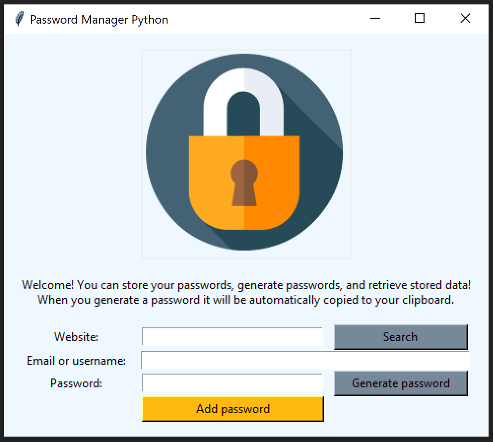
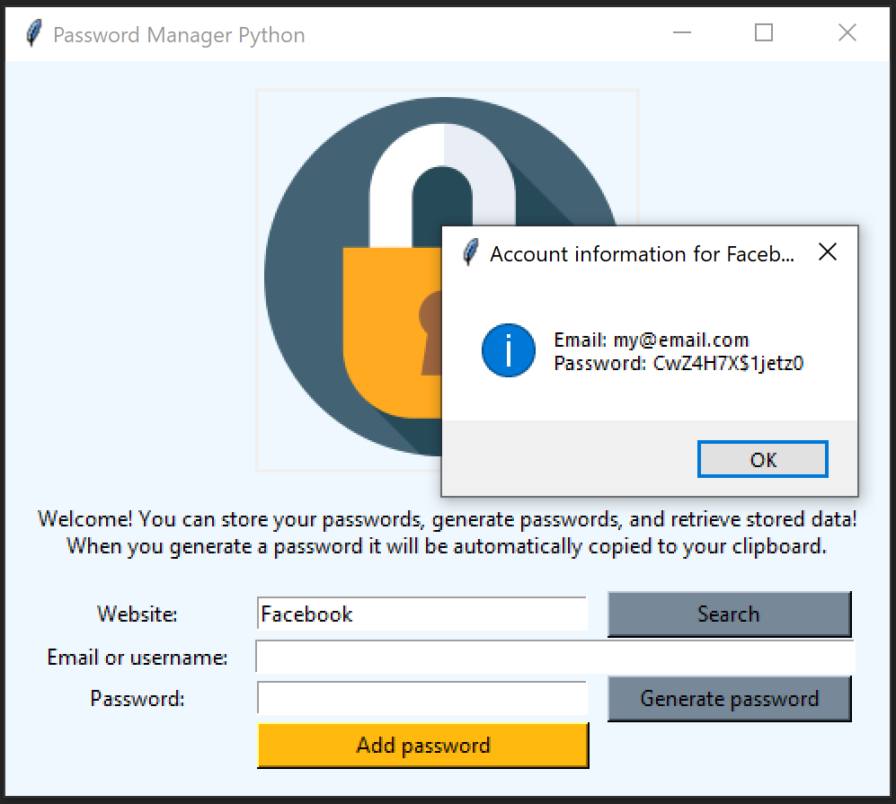

# password_manager_python
Python Tkinter password manager

The user can store email/username and password combinations for websites.
Information is stored as a json file, and user can look up previously saved account information.
The app also also allows the user to generate a password, which is then copied to the user's clipboard.

## Resources
Packages: Tkinter, random, string, pyperclip, and json.
Lock icon from: https://www.flaticon.com/free-icon/lock_2913133?term=lock&page=1&position=19&origin=search&related_id=2913133
Colours on tkinter: https://www.wikipython.com/tkinter-ttk-tix/summary-information/colors/ 